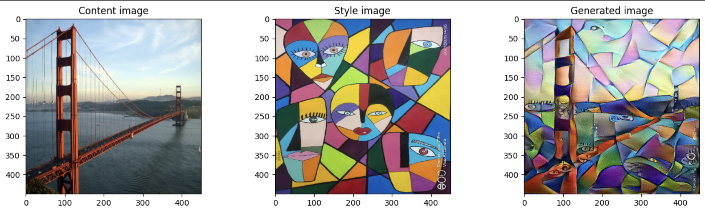

# Neural-Style-Transfer
Created a Neural network based architecture which is able to generate an image having contents of a content image drawn in the style of a style image
## Author - Omkar Nitsure
Email - omkarnitsure2003@gmail.com  
github profile - https://github.com/omkarnitsureiitb  

The model needs to be trained for every pair of **Content** and **Style** images. I have trained the model for 4 pairs of Content and style images. Content images can be found [here](Content_Images) and the Style images can be found [here](Style_Images).  

I have used the **VGG19** model which is pretrained on a very large dataset and imported the trained weights directly using **TensorFlow**. The pretrained model weights can be found [here](VGG19_Model). 
The outputs obtained from the model for the 4 pairs of images it was trained on can be found [here](Generated_Images)

### Initial Step
The content and style images were resized into 1 common shape and their individual tensors were created. The generated image was initialized by adding noise into the content image. This was done to allow for faster training as the generated image follows the content image to begin with.

### Training
The pretrained VGG19 model was used for the backbone architecture and then it was further trained for **5000** iterations on the custom loss function defined for **Neural Style Transfer**. The loss function has 2 parts namely, the loss because of the difference between the generated image and content image and the loss because of difference between the generated image and the style image.  
The following layers of the VGG19 network were used as the style layers for the loss function - 
1. Block 1 - Conv 1
2. Block 2 - Conv 1
3. Block 3 - Conv 1
4. Block 4 - Conv 1
5. Block 5 - Conv 1  

Also **alpha** was taken as 20 and **beta** was taken as 80 for the loss function. The model was trained by **Adam** optimizer using a learning rate of **0.01**

One example of the final **Generated output image** along with the input **Content** and **Style** images is as follows - 

